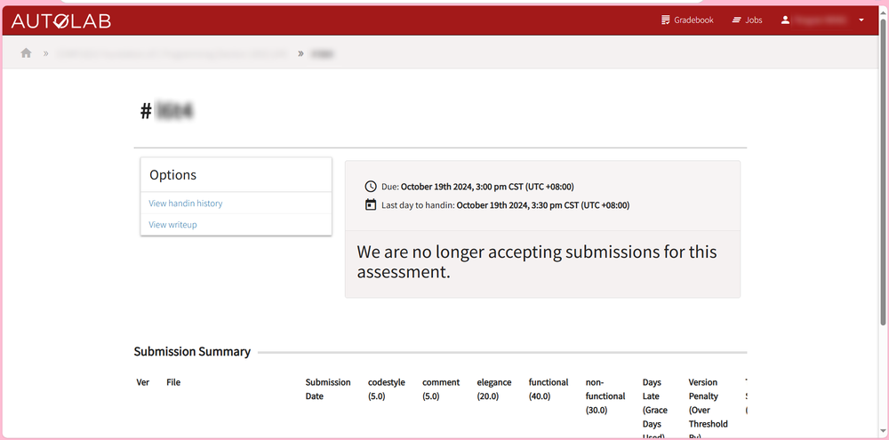
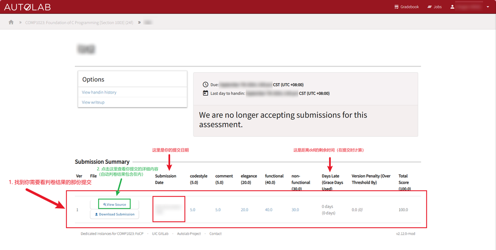
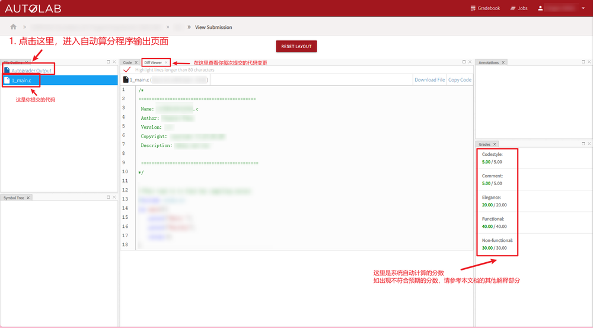
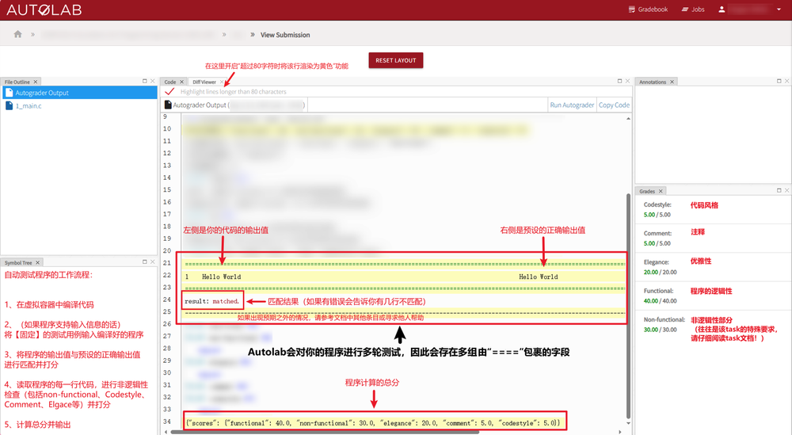

因为好多人（包括作者）都不太会用Autolab，所以这篇小贴士便应运而生

## 01: 在提交代码时

提交代码前请务必把你的`IDE\文本编辑器\任何可以写出代码的东西`的编码调整为UTF-8  
（具体怎么做请自行Google）

## 02: 如果判卷结果与预期不一致

如果你的代码被判定为0分，这意味着以下几种可能性：

- 你的代码具有语法错误
- 某个返回值为0以外的其他值
- Autolab行为异常

## 03: 在提交代码后

在你提交代码后，如果有某几项分数显示为“-”（而不是诸如“0”这样的数字），这意味着该项目将由人工评分。

## 04: 大小写严格匹配

autolab严格匹配`大小写`、`全半角`、`空格`等字符，请仔细检查后继续提交

## 05: 有限的提交次数

一般来讲，autolab有限定的提交次数【一般为三次】。当你的提交超过限定次数后，将存在按比例扣分的惩罚，请谨慎提交。

## 06: 关于如何查看判卷结果与答案

Autolab内网网址:http://172.31.13.200/

Grace day属于没有在C语言课上运用的机制。本意是给每个学生可以自由分配迟交天数。假设一个课给了每个学生5个Grace Day，那么理想情况就是这个学生因为自己的私事/身体原因等，自由的决定一些特定的作业进行迟交。而迟交的天数如果总共不超过5，都不会额外扣分。

## 07: 避免程序无法通过

> autolab很大一部分时候循环输出后面要加一个空格再换行，这样可以大大增加程序输出格式通过率（Hu，2024）

## 08: Comment给分方式

自动判卷程序依靠注释数量给分，请多写几条注释~~（个人测试：一般写10条就够）~~

## 09: 遇到Makefile报错

如果在提交过程中遇到此报错信息`The missing file are:/.../autograde-makefile`，请直接无视，这是自动判卷程序的答案未上传导致的报错，不影响正常提交该图片由[超级代码大神](https://blog.zlicdt.top/)  
友情提供

>持续完善中，欢迎投稿

[点我投稿（请注明来意，如需刊登来源信息请备注）](mailto:Chord_sky@outlook.com?subject=Autolab使用问题投稿%20&body=请输入你的投稿内容~)