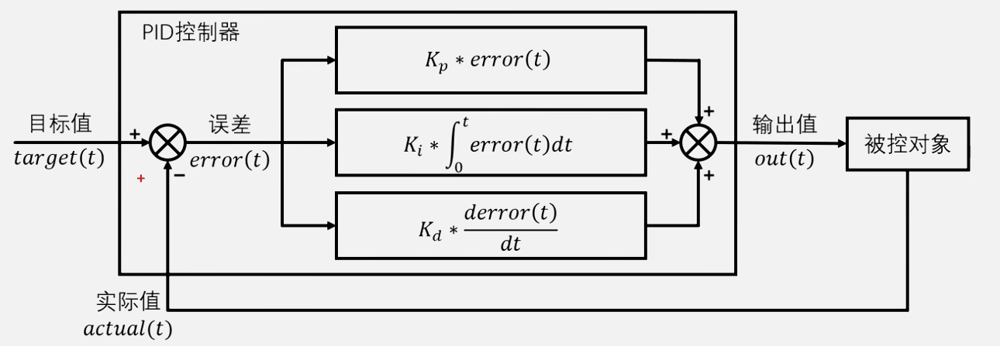
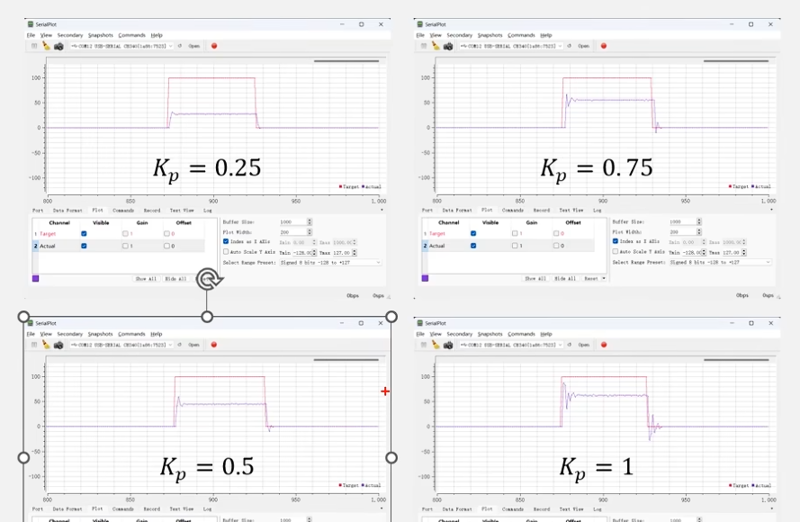
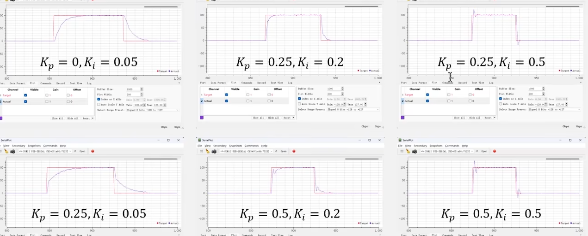
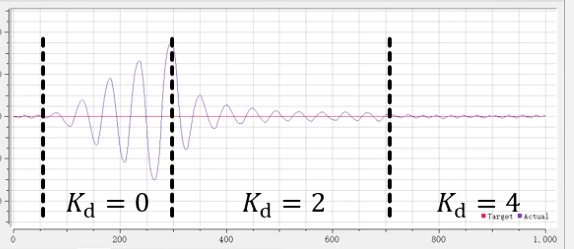
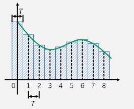

> 参考内容
> - https://www.bilibili.com/video/BV1G9zdYQEr3
> - [积分饱和 - 维基百科，自由的百科全书](https://zh.wikipedia.org/wiki/積分飽和)

**PID基本理论公式**
$$
out(t)=K_p*error(t)+K_i*\int^{t}_{0}error(t)dt+K_d*\frac{derror(t)}{dt}
$$
  

- **比例项**
- 
  - 比例项的输出仅取决于当前时刻的误差，$K_p$越大，第一部分的值越大，系统响应越快，==稳态误差==越小，但==超调==也会增加。

  - **稳态误差**

    -  一种处于非理想情况下会出现的外部因素，如：电机的摩擦力，加热板的自然散热等

    - 纯比例项控制时，如果误差为0，则$K_p$比例也是0，给被控对象的输入就是0，此时，被控对象可能会自发地向一个方向偏移而产生误差

      这个误差会让$K_p$开始负反馈调控，当调控输出力度与自发偏移力度一致时，系统将达到稳态 (如：电机的输出与电机的摩擦达到一致)。

      > [!TIP]
      >
      > 思考： 系统认为当前的输出可以让被控设备达到稳态，但实际上被控设备存在一些未知的阻力。
      >
      > 系统想要设备更靠近目标状态一些，但问题是设备上有阻力，当前误差所带来的驱动力太小的话是没办法克服阻力的。
      >
      > 所以，当驱动力=阻力时，设备就没办法继续向目标状态靠近，而是进入稳态了  在这种情况下的K_p提供了对抗摩擦力的输出

    - 给系统输入0，系统自发偏移的方向就是稳态误差的方向。

- **积分项**

  - 积分的本质是`累加`

  - $K_i$会不断累加过去的误差（包括正误差和负误差),将之作为当前的输出。

    这意味着$K_i$的输出是具有滞后性的，在系统输入目标改变一段时间后，输出才会到达目标值。（图一）

  - $K_i$会消除稳态误差的原因是：如果系统无法达到目标值，它所提供的输出会越来越大，**直到**系统达到目标值为止。
  
  - 在$K_p$和$K_i$联合运作时，先是$K_p$快速地提高输出，然后在稳态误差的作用下停止输出，此后$K_i$再依靠不断累计的输出将被控设备运动到位。
  
    

- **微分项**
  - 微分的本质是求误差变化的斜率，而斜率和当前时刻附近误差变化的趋势有关系
  - 误差变化的越大，误差变化率的斜率就越大根据斜率来输出阻力，就可以阻碍误差的急剧变化。
    - 当误差急剧升高时，对误差求导得到的斜率就会变大
    - 当误差急剧降低时，对误差求导得到的斜率就会变小
    - 直接使用这个斜率作为参数再乘以一个常量就可以给系统引入阻尼了。
  - 如果$K_d$给的过大，阻尼就会过大，此时系统会表现得“卡卡的”

倒立摆电机编码器在不同$K_d$时的输出值拟合曲线。

---

**将PID离散化**

原有的pid公式是一个线性过程，适用于模拟电路。但是在数字电路中并不适用，所以需要进行离散化

原有公式$out(t)=K_p*error(t)+K_i*\int^{t}_{0}error(t)dt+K_d*\frac{derror(t)}{dt}$

- 通过面积法，可以把$K_i$转换为$K_i*T\sum^t_{j=0}error(j)$ 
  - 其中$T$为单个步长，即“所有矩形面积相加之和”

- 通过中值定理，可以把$K_d$转换为$K_d*\frac{error(k)-error(k-1)}{T}$
  - 公式中分数的含义即对应“矩形的中值”。

最终得到公式
$$
out(t)=K_p*error(k)+K_i*T\sum^t_{j=0}error(j)+K_d*\frac{error(k)-error(k-1)}{T}
$$
当然我们也可以把T并入到$K_i$和$K_d$中，也就是
$$
out(t)=K_p*error(k)+K_i*\sum^t_{j=0}error(j)+K_d*error(k)-error(k-1)
$$

---

**全量式PID和增量式PID**

全量式PID

- 即传统式PID
- 优势
  - 可以直接输出给目标设备

增量式PID

- 即输出为上一次的增量(或负增量)
- 优势
  - 计算方便：只需要得到`out(k)` `out(k-1)` `out(k-2)`这三个值就可以计算增量了
  - 限幅更方便（防止积分饱和[^1]与过摆）
  - 因为会持续存储控制状态，在手动切换到自动的过渡中会更平缓(全量式pid需要一定的时间来进行适应)
- 计算公式：$\Delta out(k)=out(k)-out(k-1)$

$$
\Delta out(k)=[K_p*(error(k)-error(k-1))]+[K_i*error(k)]+[K_d*(error(k)-2error(k-1)+error(k-2)])
$$

---

[^1]:积分饱和是指[PID控制器](https://zh.wikipedia.org/wiki/PID控制器)或是其他有[积分器](https://zh.wikipedia.org/wiki/積分器)的控制器中的现象，是指误差有大幅变化（例如大幅增加），积分器因为误差的大幅增加有很大的累计量，因此造成[过冲](https://zh.wikipedia.org/wiki/过冲)，而且当误差变为负时，其过冲仍维持一段时间之后才恢复正常的情形

---

**更高级的PID**

积分限幅

积分分离(线性&非线性)

【待补充】

