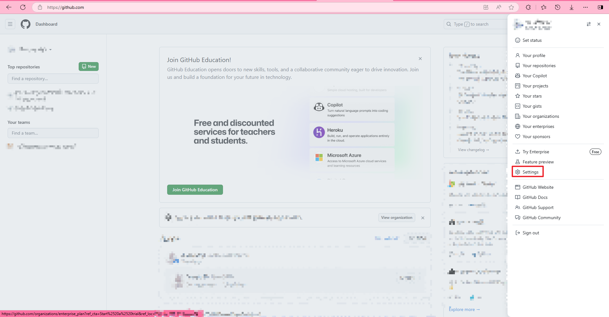
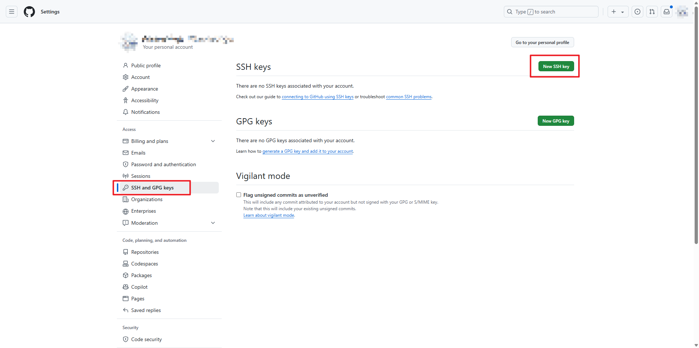
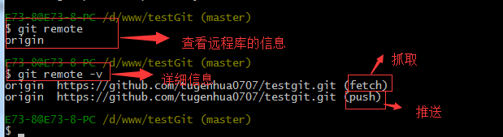
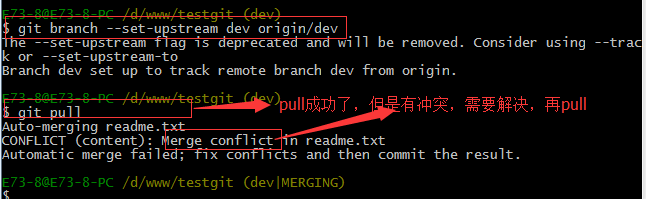
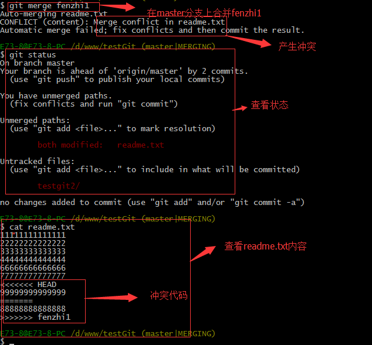

# 简单的GIT教学

## 开箱配置

配置你的用户信息（用于确定你的身份，并非登录）
```
  git config --global user.email "you@example.com"
  git config --global user.name "Your Name"
```
## 常用命令
#### `git init`
在指定的根目录创建.git，这就是代码仓库，别动它！
#### `git clone`
把别人的在线仓库下载到本地

#### `git log`

查看提交记录、文件变更、提交id
#### `git status`
查看是否有未提交的新更改
#### `git diff <>`
当使用commit id来代替`<>`时，将查看该次提交的具体变更记录
当使用文件名来代替`<>`时，将查看该文件的具体变更记录

## 提交流程

#### `git add <filename>`
(仅当你创建了新的文件时才需要使用)
把你的更改提交到本地暂存区
`<filename>`用你想要提交的文件名替代，如果你想要提交仓库根目录的所有文件，使用`.`来替代`<filename>`

#### `git commit -m "comment"`
提交本地暂存区的文件
`comment`是可选内容，如果需要，用注释（本次提交的简单概括）来替代

## Backtrack
>使用`git log`以查看提交id，
>如果显示信息太多，使用如下命令
>`git log –pretty=oneline`
#### `git diff <commit id>`
使用提交id替代`<commit id>`，即可查看该次提交的具体变动

#### `git reset --hard <>`
使用`^`替代`<>`，将回到上一提交
使用提交id替代`<>`，将回到id对应提交
- 在git reset前想清楚！你到底需不需要reset！
### 误git reset后的挽回手段
#### `git reflog`
展示当前仓库的引用日志，记录当前仓库的“HEAD、分支或其他引用”的变化记录
我们使用这个命令来获取需恢复提交记录的哈希
#### `git checkout <commit id>`
使用你获取到的提交记录哈希值替换`<commit id>`，来恢复对应提交记录
- 在完成恢复后，你会处于`detached HEAD`分支状态，请创建新分支来继续开发
- 记得跟你的团队成员说一声你误操作了，在你向线上仓库提交之前
## Branch
- git具有一个强大的分支功能
- 一个项目，一定具有一个主分支（以前叫`master`现在叫`main`..因为`master`有奴隶主的意思,要避嫌)
- 搞开发请自己创建一个dev分支，在dev分支上干活，干完活并确保没问题后再把内容合并到main上。
- 往主分支上丢东西要慎重！无论何时，主分支应该永远是你最稳定的分支
- 主分支的内容必定小于等于其他分支，如果主分支的东西比其他分支多了，那么提交的时候就会出现合并冲突！
#### `git branch`
查看分支

#### `git checkout –b <name>`
创建+切换分支

#### `git checkout <name>`
切换分支

#### `git merge <name>`
合并某分支到当前分支

#### `git branch –d <name>`
删除分支

## Remote repo
### 把你的本地仓库与云端仓库关联起来
#### 生成私钥文件
- 执行命令
`ssh-keygen -t rsa -C "xxxx@example.com"`
把`xxxx@example.com`替换成你的邮箱地址（用于识别你）
- 直接回车生成默认目录
- 密码不想设置可以直接回车两下，如设置密码后每次提交均需要输入密码
- 私钥的默认存储路径为`/c/Users/<username>/.ssh/id_rsa`，在gitbash窗口里也有写
#### 导出你的私钥内容
- 转到存储刚才生成的私钥目录
- 在当前目录右键打开git bash
- 使用命令`cat ~/.ssh/id_rsa.pub`
- 复制输出的内容，以`ssh-rsa`开头，而以`.com`作为结尾
#### 配置GitHub
- 打开github的settings页面
- 
- 
- 把你刚才复制的私钥内容粘进去，请注意，`rsa`开头的是私钥，不能泄露
- 起个有意义的名字填上去
- 保存

### 与云端仓库进行同步

#### 建个仓库不需要教吧

#### `git remote add origin <your repo link>`
使用你的仓库地址替代`<your repo link>`，
- 把本地库的内容推送到远程，使用 git push命令，实际上是把当前分支master推送到远程。

- 由于远程库是空的，我们第一次推送`main`分支时，加上了 `–u`参数，Git不但会把本地的`main`分支内容推送的远程新的`main`分支，还会把本地的`main`分支和远程的`master`分支关联起来，在以后的推送或者拉取时就可以简化命令。
例如：
`git remote add origin https://github.com/Rinsutoringu/COMP1023-Foundations-of-C-Programming.git`
#### `git push origin <branch name>`
把`<branch name>`替换为分支名（如main）
- 之后对云端已存储的某分支作修改后，使用这条指令向云同步。

>不要在远程仓库上干活，搞什么乱七八糟的事情在本地搞好了再push上去！

### 多人协作
>当你从远程库克隆时候，实际上Git自动把本地的master分支和远程的master分支对应起来了，并且远程库的默认名称是origin。
>如果要多人协作的话，每个人都要开一个属于自己的分支来干活，干完活的内容要提交到属于自己的main分支上，经过审核后才能合并到主要的main分支。

####  `git remote`
查看远程库的信息(如名称)
#### `git remote –v`
查看远程库的详细信息


#### `git push origin <branch name>`

推送本地指定分支到云端

#### `git checkout –b <branch name> origin/<branch name>`
从云端拉取指定名称的分支到本地
#### `git pull origin <branch name>`
从云端合并到本地
- 如果其他人改动了项目的其他结构，那么你就没法直接向云端提交了。
- 因为git的逻辑是多的那方给少的那方提交资料
- 你就得执行这条指令来同步其他人的工作，然后再提交自己的东西。
- 就算仓库同名，也不一定能push上去，因为git需要关联远程仓库，请关注git的错误提示来进行手动关联。
- 
## 解决合并冲突

- 先尝试合并，如果有冲突会报错，看着报错信息自行处理。
- 处理好了重新提交即可

## 记得配置代理！

```bash
git config --global http.proxy http://127.0.0.1:1080
git config --global https.proxy https://127.0.0.1:1080
// 全局代理
```

```bash
- git config --global http.https://github.com.proxy https://127.0.0.1:1080
git config --global https.https://github.com.proxy https://127.0.0.1:1080
// 仅配置git的代理
```

[Git 代理设置方法 - 余以为](https://www.cnblogs.com/China-Dream/p/16476775.html)