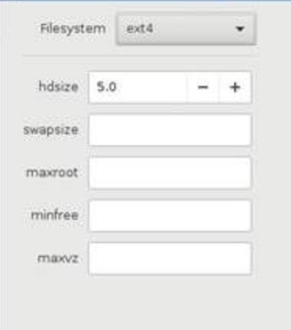
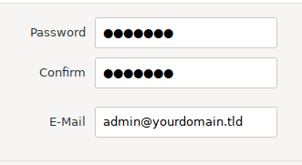
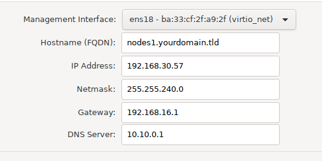
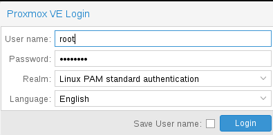

# 什么是PVE？

>Proxmox Virtual Environment is a complete open-source platform for enterprise virtualization. With the built-in web interface you can easily manage VMs and containers, software-defined storage and networking, high-availability clustering, and multiple out-of-the-box tools using a single solution.
## 下载PVE
请在[这里](https://www.proxmox.com/en/downloads)下载`.iso`格式（因为我们要把PVE装到物理机上）的
`Proxmox VE x.x ISO Installer`文件
## 刻录U盘
下载最新版本的`Rufus`，并直接选择你刚才下载的`.iso`文件，此时Rufus会提示选择dd格式，确定即可。
## 调整安装设备BIOS设置
关闭安全启动，如有超频设置也请尽可能恢复原有配置。
## 引导启动
启动前记得先把网线接好！
## 配置安装选项
### 硬盘设置

- 点击左侧选择你想要部署PVE的物理硬盘
- 点击右侧打开硬盘区域划分窗口


- `Filesystem` （文件系统）：可以设置磁盘分区格式，一般为默认的EXT4
- `hdsize` （硬盘容量）：定义目标硬盘的容量大小，通过设置这个参数，你可以配置硬盘预留部分空间给他用。
	- 建议不要预留空间，不要在系统盘上再建立其他卷组，要完整使用目标硬盘空间。
- `swapsize` （交换分区容量）：定义swap逻辑卷的容量大小，默认和服务器物理内存容量大小一致，最小值为4GB，最大值为8GB，最大值不能大过`hdsize/8`。注意，如设置为0，将不会创建swap逻辑卷。
- `maxroot` 用于保存PVE操作系统镜像的独立空间，最大值限制为`hdsize/4`
	- （作为参考：Windows 10的安装镜像大小约7GB）
- `minfree` 预留空间：定义pve卷组容量中除了`swap`、`root`以及`data`逻辑卷容量之外剩余的可用容量大小，也就是说`minfree`大小可以按照下面方式来计算
	-  `minfree = pve - swapsize - rootsize - datasize`
- `maxvz` 用于保存数据之用，例如创建的虚拟机硬盘空间，虚拟机文件容量大小不能超过`maxvz`。
>如果已经安装好了又想调整分区大小，可以考虑重装系统。因为lvm分区只能扩容不能缩减容量。而重装系统操作也不太麻烦，只需要把所有虚拟机通过拍快照的方式备份到别的磁盘，然后在新系统上还原即可。

### 时区配置

- `Country` 国家/地区：匹配与你物理距离最近的镜像站，如实配置即可
- `Time zone` 配置系统时区
- `Keyboard Layout` 键盘布局
### 用户名及密码


- 输入你的密码并重复！***请妥善保管***
- 输入你正常使用的邮箱，这样一来，如果你的PVE出了什么问题，你将会收到邮件提示（前提是你的PVE成功连接到了外网）
	- 警告有两类
		- 系统警告，比如磁盘SMART警告
		- 执行cron任务失败警告（包括自己配置的cron任务）
### 配置网络信息


- `Management Interface` （管理端口）：这里需要填写分配给 PVE 用于管理的**物理网口**。确保在启动时已将网线接入此管理网口，并在电脑上配置固定 IP 以访问 PVE 的 WebUI。
- `Hostname (FQDN)`（主机名）：这里需要填入 PVE 的 `Hostname`。正确设置主机名后，可以方便局域网中的各个设备相互识别，这里作者娘建议将PVE的`Hostname`设置为 `pve.<my_name>.local`
- `IP Address (CIDR)` （IP地址）：这里要求填入 PVE宿主机 的静态IP，如果你在引导开机前便将网线接入设备，这里应该会被自动填充
- `Gatway` （网关）：这里要填写PVE宿主机的网关地址，如果你在引导开机前便将网线接入设备，这里应该会被自动填充
- `DNS Server` （DNS服务器）：这里要填写PVE宿主机的DNS服务器地址，如果你在引导开机前便将网线接入设备，这里应该会被自动填充
* * *
如果没有什么意外的话，一路确定后出现的进度条会顺利走完并自动重启，记得拔掉你的U盘并在bios确定启动项。
### WebUI登录
在浏览器中输入你分配给PVE宿主机的IP与端口（默认`8006`）即可访问


- 默认用户名为`root`
- 密码为你刚才在安装时配置的密码
- Realm为身份验证，本次登录中无需配置
- Language  *让我们说中文*

## 后续配置

### 更换软件源
pve默认配置的是需要付费的企业源，需要配置成免费源。
此外，如果服务器在国内，我们需要更换为清华大学开源软件镜像站的pve和Debian源。
输入下方命令删除该文件`/etc/apt/sources.list.d/pve-enterprise.list`
```
rm -f /etc/apt/sources.list.d/pve-install-repo.list
```
输入下方命令添加TUNA的pve免费源。
```
echo "https://mirrors.tuna.tsinghua.edu.cn/proxmox/debian buster pve-no-subscription" > /etc/apt/sources.list.d/pve-no-subscription.list
# OR
echo "deb http://download.proxmox.com/debian/pve bullseye pve-no-subscription" > /etc/apt/sources.list.d/pve-no-subscription.list
```
输入下方命令更换Debian源
```
echo "# 默认注释了源码镜像以提高 apt update 速度，如有需要可自行取消注释
deb https://mirrors.tuna.tsinghua.edu.cn/debian/ buster main contrib non-free
# deb-src https://mirrors.tuna.tsinghua.edu.cn/debian/ buster main contrib non-free
deb https://mirrors.tuna.tsinghua.edu.cn/debian/ buster-updates main contrib non-free
# deb-src https://mirrors.tuna.tsinghua.edu.cn/debian/ buster-updates main contrib non-free
deb https://mirrors.tuna.tsinghua.edu.cn/debian/ buster-backports main contrib non-free
# deb-src https://mirrors.tuna.tsinghua.edu.cn/debian/ buster-backports main contrib non-free
deb https://mirrors.tuna.tsinghua.edu.cn/debian-security buster/updates main contrib non-free
# deb-src https://mirrors.tuna.tsinghua.edu.cn/debian-security buster/updates main contrib non-free" > /etc/apt/sources.list

```


### 开启设备直通（IOMMU）
如果想直通PCIE设备的，比如显卡、sas卡等，需要开启IOMMU。

- 编辑文件`/etc/default/grub`

	- 对于intel的CPU，将`GRUB_CMDLINE_LINUX_DEFAULT`所在行添加`intel_iommu=on`
		```
		GRUB_CMDLINE_LINUX_DEFAULT="quiet intel_iommu=on" 
		```
	- 对于AMD的cpu，将`GRUB_CMDLINE_LINUX_DEFAULT`所在行添加`amd_iommu=on`
		```
		GRUB_CMDLINE_LINUX_DEFAULT="quiet amd_iommu=on" 
		
		```

操作完成后执行`update-grub`并重启

将这些内容添加进`/etc/modules`
```
vfio
vfio_iommu_type1
vfio_pci
vfio_virqfd
```